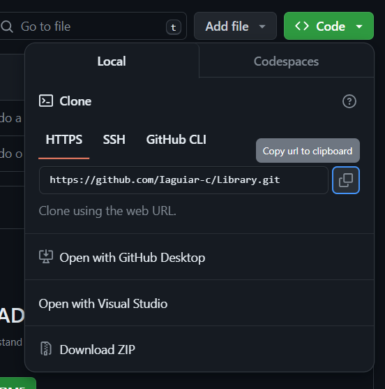
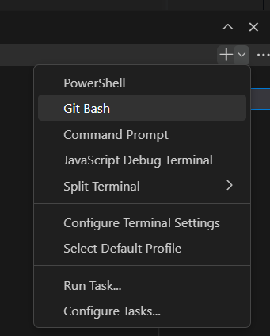
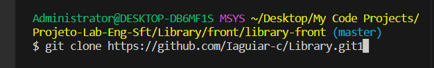
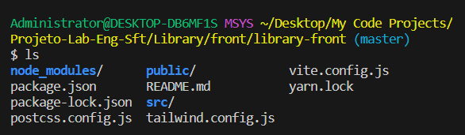
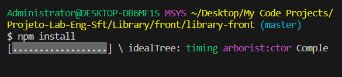
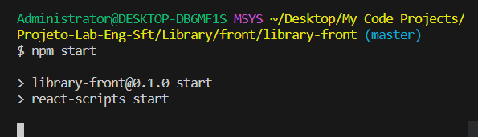
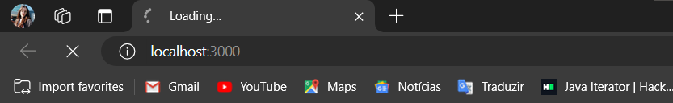

# Como rodar o projeto

## Via Git 

1) Vá até o projeto no Github através do Link 

2) Copie o Link HTTPs

3) Abra o VSCode e aperte: Control + J (um terminal Powershell será aberto)

4) Abra um novo terminal Git clicando na setinha e após isso clique em "Git Bash"

5) Clique no terminal e digite "Git clone", assim, aperte shift + insert para inserir a URL copiada do Github 

6) Certifique-se de estar na pasta raiz do front-end. Para isso, dê "ls" em seu terminal e se for o caso digite "cd nome-da-pasta-que-você-quer-entrar" 

7) Quando você der "ls" e ver os seguintes arquivos, significa que você está na pasta correta do front-end 

[somente executar os próximos passos depois que estiver na pasta certa]

8) Digite "npm install" para instalar as dependências no projeto 

9) Digite "npm start" para rodar a aplicação localmente

10) Caso o projeto não abra, você pode visualizar as telas digitando "localhost:3000" em seu navegador 

# Como Commitar 

Após todo o seu desenvolvimento, commite seus arquivos e sempre certifique de colocá-los no Github 

